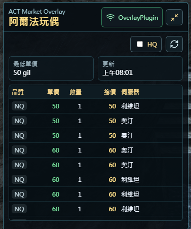

# ACT Market Overlay

FF14 用的 ACT OverlayPlugin 市場查詢 Overlay。



監聽 `LogLine` 內的「正在確認「物品」的持有數量。」訊息（即在道具欄對物品按右鍵選「確認持有數量」），將物品名自動轉成 item id 後查詢 [Universalis](https://universalis.app/) 目前的在售列表。

## 使用需求

- [Advanced Combat Tracker (ACT)](https://advancedcombattracker.com/)
- [FFXIV ACT Plugin](https://github.com/ravahn/FFXIV_ACT_Plugin)
- [OverlayPlugin](https://github.com/OverlayPlugin/OverlayPlugin)

## 安裝方式

### 方法一：使用線上版本（推薦）

1. 開啟 ACT，切換到 **Plugins → OverlayPlugin.dll** 頁籤
2. 點擊左下角的 **New** 按鈕，建立新 Overlay
3. 在彈出視窗中：
   - **Name**：填入任意名稱，例如 `Market`
   - **Type**：選擇 `MiniParse`
   - 點擊 **OK**
4. 在左側清單選取剛建立的 Overlay（例如 `Market`）
5. 在 **URL** 欄位填入：
   ```
   https://unnbird.github.io/FF14MarketOverlay/
   ```
6. 點擊 **Reload overlay** 完成設定

### 方法二：使用本機建置版本

先完成建置（見下方建置說明），再將 URL 欄位改為本機路徑：
```
dist/index.html
```

## 使用方式

1. 確認 Overlay 已顯示且狀態顯示為已連線
2. 在遊戲中開啟道具欄，對任意物品按右鍵，選擇「確認持有數量」
3. Overlay 會自動偵測物品名稱並查詢 Universalis 市場資料
4. 可在 Overlay 右上角切換查詢目標（伺服器 / DC / 全區域）及 HQ 篩選

## 開發

```powershell
npm install
npm run dev
```

開發時可將 OverlayPlugin URL 指到 `http://127.0.0.1:5173/`。

## 建置

```powershell
npm run build
```

建置後的檔案位於 `dist/` 資料夾，可將 OverlayPlugin 指到 `dist/index.html`。